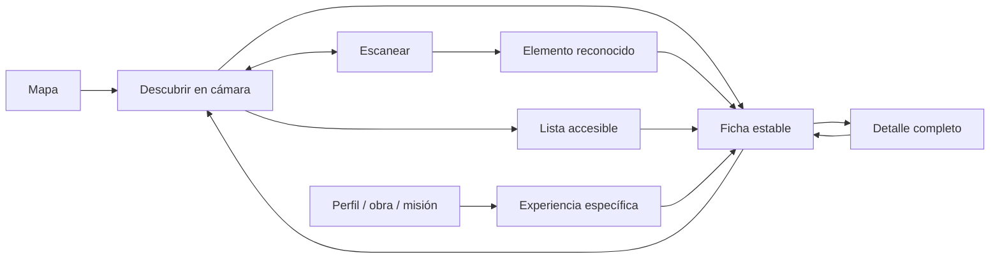

# MAREA · Diseño de la experiencia AR

Fecha: 30 de septiembre de 2026. Estado: diseño conceptual aprobado, prototipo para evaluación. La validación con personas está pendiente.

## Propósito y alcance

**La ciudad se convierte en escenario.** AR conecta espacios físicos con la identidad, creatividad y oportunidades publicadas en MAREA. La persona debe entender qué encontró, dónde está, quién lo publicó y qué puede hacer.

Dirección acordada: **equilibrada**. Pistas discretas durante la exploración; identidad y contenido expresivos al seleccionar. Publicación con **control mixto**: responsables verificados publican en sus espacios; colaboradores solicitan autorización; MAREA revisa espacios sin responsable y disputas.

Esta entrega define UX/UI y un [prototipo interactivo](design-experiments/marea-ar-prototype.html), un fragmento para visualizar en Codex. No integra cámara, sensores, reconocimiento, modelos 3D, permisos del sistema ni Supabase. Todos los ejemplos son ficticios y las acciones de publicación son simuladas. La aplicación actual continúa sin AR.

## Arquitectura de la experiencia

### Entradas y regreso

- Mapa: acción «Explorar en AR». Usa la posición actual del visitante, no el centro consultado. Si difieren, explica «La cámara explorará donde te encuentras» antes de continuar. Conserva zona, búsqueda y filtros originales al regresar; no simula que la persona está en la zona remota.
- Perfil, obra o misión: acción «Ver experiencia AR» solo cuando hay contenido asociado. Si necesita presencia física, muestra lugar, explicación y «Ver en mapa». El contenido informativo sigue disponible a distancia.
- Distintivo: la persona elige «Escanear». Reconocer selecciona el elemento, pero no abre el detalle, un enlace externo ni reproduce medios automáticamente.
- Detalle: regreso devuelve a la ficha seleccionada con sus filtros y modo. Salir de cámara devuelve a su entrada original. El prototipo permite recorrer esas entradas sin navegar por la app real.

### Modos y permisos

| Modo | Intención | Ayuda | Información de posición |
|---|---|---|---|
| Descubrir | Encontrar contenido cercano | «Mira a tu alrededor» | Dirección y distancia aproximadas; no identificación de fachadas |
| Escanear | Reconocer un activador registrado | «Encuadra la imagen o distintivo registrado» | Reconocimiento explícito; no exige ubicación si el contenido no la necesita |
| Ver en el espacio | Colocar una obra o producto | «Elige dónde colocar la obra» | Experiencia enfocada, separada del descubrimiento |

Primera entrada: explicación breve de para qué se necesita cada permiso y opción de seguir en mapa/lista. Solicitar cámara al elegir usarla; solicitar ubicación para Descubrir. Rechazar ubicación no bloquea el escaneo de un activador no geográfico. No solicitar acceso en segundo plano.

La cámara y los sensores se pausan al salir, enviar la app a segundo plano o abrir un detalle de lectura. Regresar a la cámara puede necesitar recuperar orientación o reconocimiento; nunca presenta el último reconocimiento como vigente sin confirmarlo.

## Pantallas y componentes

### Cámara

- Arriba: regreso, título y filtro; debajo, selector Descubrir/Escanear con selección textual visible.
- Centro: entorno despejado. Indicadores de categoría, nombre corto y distancia precedida de «≈». La ciudad no se oscurece con una capa general permanente.
- Abajo: ayuda contextual o ficha seleccionada; accesos a mapa y lista fuera de la zona tapada por la ficha.
- La navegación social se oculta dentro de la cámara y reaparece al salir.

**Indicadores:** límite inicial de cinco puntos individuales para validar, no cuota que se deba llenar. Agrupar superposición con una etiqueta como «Bazar · 3 proyectos». Tocar el grupo abre sus participantes en una lista estable. Un espacio reúne eventos, promociones y misiones; una obra independiente conserva su punto. Cercanía, filtro e interés explícito guían relevancia; no se define publicidad pagada ni ranking comercial.

**Selección:** tocar resalta el indicador y abre una ficha inferior. La ficha permanece estable al mover el teléfono. Cerrar restablece exploración. Ninguna tarjeta aparece simplemente por pasar frente a un negocio.

**Filtros:** Todo, Lugares, Obras, Misiones y Eventos. Los emprendimientos con punto propio se incluyen en Lugares; dentro de un bazar se muestran como participantes. Se comparten entre cámara y su lista; no sobrescriben filtros del mapa original. Filtrar sin resultados ofrece «Mostrar todo».

### Ficha breve y detalle

La ficha usa categoría, imagen cuando existe, título, autor/responsable, lugar o distancia, un destacado vigente y una acción principal. No inventar imágenes cuando el contenido no tiene fotografía. Cerrar y Guardar son secundarios. Guardado es una interacción local simulada en el prototipo.

| Contenido | Destacado | Acción principal | Detalle |
|---|---|---|---|
| Negocio | Actividad o información vigente | Ver perfil | Horarios, catálogo/servicios, contacto voluntario, eventos y misiones |
| Emprendimiento | Proyecto o producto | Ver catálogo | Productos y vínculo temporal con su espacio |
| Obra | Título y autor | Conocer la obra | Historia, autor, medios disponibles y portafolio |
| Misión | Oportunidad, compensación y fecha | Ver misión | Condiciones y participación existentes |
| Evento | Actividad, fecha y lugar | Ver información | Programa y participantes disponibles |

«Espacio verificado» identifica al lugar; «Publicado por…» identifica al autor. No usar la misma insignia para ambas cosas. La distancia no es una ruta ni un tiempo de llegada. Seguir artistas, comprar, reservar o reproducir medios solo tendrán controles cuando exista esa función en el producto.

### Experiencia enfocada

Desde una obra compatible: «Ver en el espacio» abre un modo específico. Antes de colocar: guía y acción «Colocar aquí». Después: ajuste de tamaño y giro, «Restablecer», «Volver a colocar» y «Salir». No modifica la obra original ni publica el resultado. El prototipo usa una representación ilustrativa; no demuestra detección real ni precisión física.

### Perfil y administración

Perfil propio profesional: apartado «Experiencia AR» con experiencias, estado, espacio y vigencia. Acción «Crear experiencia». Perfil visitante: contenidos públicos y entrada a cada experiencia. Perfil general puede descubrir; no recibe editor profesional.

Editor en cuatro pasos con regreso que conserva datos:

1. **Contenido:** elegir un elemento existente compatible; título y destacado breve. No duplicar el catálogo ni exigir un archivo técnico.
2. **Espacio o activador:** espacio propio, espacio ajeno o temporal. Diferenciar encontrar por ubicación, reconocer activador y contenido que puede verse desde cualquier lugar. Para reconocimiento, la imagen/distintivo se registra como un elemento único: el logo genérico de MAREA no identifica por sí solo a qué negocio pertenece.
3. **Vigencia y acción:** inicio/fin opcionales para contenidos permanentes, fin obligatorio para participación temporal; acción determinada por el contenido. Evitar fechas invertidas o vacías en temporales. Mostrar horario local y zona del lugar cuando difiera de la del visitante.
4. **Vista previa:** revisar indicador y ficha; nombre del lugar y autor visibles; resumen de vigencia y aprobación. Botón «Publicar» en espacio propio verificado o «Solicitar vinculación» en espacio ajeno/sin verificar. Guardar borrador sin publicar.

La autorización corresponde a la asociación de ese contenido con ese espacio y su vigencia. No permite editar el lugar ni contenido de terceros. Cambiar espacio, activador o contenido de una experiencia aprobada solicita nueva revisión; mantiene la versión pública anterior hasta aprobación o permite pausarla.

| Estado | Qué ve el autor | Qué ve el visitante |
|---|---|---|
| Borrador | Continuar, previsualizar, eliminar borrador | No aparece |
| Pendiente de aprobación | Responsable de revisión, solicitud y opción de retirar | No aparece |
| Publicado | Previsualizar, editar, pausar | Descubrible solo durante su vigencia |
| Pausado | Reanudar durante vigencia o editar | No aparece en descubrimiento; enlace explica pausa |
| Finalizado | Consultar y crear una nueva experiencia | Fuera del descubrimiento; detalle indica finalización |
| Requiere cambios | Motivo concreto, corregir y reenviar | No aparece |

Revisor: ve autor, espacio, contenido, vigencia y preview. Puede aprobar o pedir cambios con motivo. Cuando no hay responsable verificado o existe una disputa, MAREA resuelve. Un reporte de visitante solicita motivo; no retira contenido automáticamente por un reporte aislado.

## Estados y microcopy

| Estado | Mensaje | Acción útil |
|---|---|---|
| Permisos pendientes | «Usa la cámara para descubrir tu entorno» | Continuar / Seguir en mapa |
| Cámara rechazada | «La cámara no está disponible» | Reintentar / Ver lista; Ajustes si el rechazo es permanente |
| Ubicación rechazada | «Activa tu ubicación para descubrir lo cercano» | Reintentar / Escanear / Volver al mapa |
| Buscando puntos | «Buscando experiencias cercanas…» | Ver lista / Volver al mapa |
| Sin contenido | «Todavía no hay experiencias aquí» | Ver mapa / Escanear |
| Orientación imprecisa | «La dirección es aproximada» | Ver lista; no prometer alineación exacta |
| Reconocido | «Imagen reconocida» | Abrir ficha; elegir abrir el detalle |
| Reconocimiento perdido | «La imagen ya no está en el encuadre» | Mantener ficha / Volver a escanear |
| Sin conexión | «No podemos actualizar las experiencias» | Reintentar / Ver información disponible; identificar su antigüedad |
| Vencida | «Esta experiencia finalizó» | Ver autor / Volver al mapa |
| No compatible | «Puedes descubrir este contenido en el mapa» | Ver mapa / Ver lista |

Con datos previamente disponibles, un fallo conserva la lectura e indica que no se ha actualizado. Nunca mantiene «activo hoy», cupo disponible o reconocimiento conseguido como información recién confirmada. En el prototipo el estado sin conexión no demuestra caché ni funcionamiento offline real.

## Lenguaje visual y accesibilidad

- Nunito Sans; títulos 20–24 px, cuerpo 16 px, anotaciones 12–14 px. Tokens y geometría del [sistema visual existente](design-system.md).
- Navy `#0B255E`, acción azul `#0D4397`, aqua `#22C5C1`, fondo Paper `#FAF9F6`, texto `#102149`. Categorías en lavanda, durazno, rosa y menta con etiquetas e iconos.
- Fichas opacas, relieve moderado y radios 20–28 px. Aqua funciona como acento; no usar texto blanco sobre aqua como CTA pequeño.
- Controles táctiles de al menos 48 px. Nombre accesible en botones de icono, foco visible y contenido esencial disponible sin hover.
- Abrir filtros o una ficha modal bloquea interacción con el fondo; cerrar devuelve el foco al control de origen. Escape cierra paneles o vuelve al nivel anterior. La lista permite completar el recorrido sin orientación física ni cámara.
- Movimiento funcional 150–300 ms, respetando reducción de movimiento. Reconocimiento y selección se anuncian una vez, sin lectura continua de sensores.
- Referencia: [UI elements de Google ARCore](https://developers.google.com/ar/design/interaction/ui). La representación geográfica aproximada y el reconocimiento visual se distinguen siguiendo sus [conceptos de posicionamiento geoespacial](https://developers.google.com/ar/develop/geospatial) y [referencias de imágenes](https://developers.google.com/ar/develop/augmented-images).

## Prototipo y validación

El selector «Recorrido» está fuera de la interfaz del producto: sirve para cambiar de escenario de evaluación. «Simular reconocimiento» tampoco será un botón de producción. El editor, guardados y aprobación solo cambian el estado local de la visualización; nada se publica.

Escenarios: mapa, descubrir, escanear, perfil, editor, administración, revisión, permisos, búsqueda, zona vacía, orientación imprecisa, reconocimiento perdido, sin conexión y experiencia vencida. Desde fichas se accede a detalles y a colocación simulada. El bazar permite abrir y distinguir tres participantes.

### Guion de evaluación con personas

No explicar cómo resolver las tareas. Pedir que describan qué esperan antes de tocar. Registrar errores, dudas y si creen que el indicador identifica exactamente la fachada.

1. Encuentra qué ocurre hoy en Café Marea y quién publica la información; entra y vuelve sin perder contexto.
2. Encuentra la misión de muralismo; identifica compensación, fecha y acción siguiente.
3. Reconoce «Marea Nocturna», identifica a su autora y continúa leyendo cuando se pierde el reconocimiento.
4. Encuentra Barro Vivo dentro del bazar; distingue puesto, recinto y autor.
5. Rechaza ubicación; consigue consultar contenido por otra vía. Rechaza cámara; usa la lista.
6. Publica una experiencia en tu espacio verificado. Luego solicita vinculación a uno ajeno y explica quién debe aprobar.
7. Recibe un pedido de cambios, identifica el motivo, corrige y reenvía. Pausa y reanuda una experiencia vigente.
8. Consulta una experiencia finalizada y evita confundirla con una oportunidad activa.

Objetivo inicial: cada tarea se completa sin intervención del facilitador y la persona identifica contenido, espacio, autor y acción. Las confusiones de precisión, vigencia o autorización requieren ajustar el diseño antes del desarrollo.

### Entrega posterior a desarrollo

Este documento define comportamiento de producto; no selecciona SDK, dependencia Flutter, esquema de base de datos, presupuesto ni calendario. El mapa actual contiene misiones; habrá que diseñar la representación compartida de espacios, obras, eventos y experiencias. Los posts de evento existentes no constituyen por sí solos agenda, programa ni caducidad estructurada. La revisión espacial, activadores únicos y capacidades reales de dispositivos requieren evaluación técnica posterior.

La inspección del prototipo verifica navegación y presentación simuladas. No sustituye pruebas de reconocimiento, precisión de orientación, permisos nativos, cobertura en ciudad, accesibilidad con lectores de pantalla reales ni validación con usuarios.
